

<a href="https://ratneshwarpandey12220865.github.io/"></a>

  <a href="https://ratneshwarpandey12220865.github.io/"><b>▶ Interactive portfolio</b></a> ·
  <a href="#projects"><b>Projects</b></a> ·
  <a href="#stack"><b>Stack</b></a> ·
  <a href="#experience"><b>Experience</b></a> ·
  <a href="#recognition"><b>Recognition</b></a> ·
  <a href="#contact"><b>Contact</b></a>

  
  
  
  

 

  <a href="https://github.com/RatneshwarPandey12220865/Government-Gazette-Intelligence-Agent"></a>
  <a href="https://github.com/RatneshwarPandey12220865/TaskPilot"></a>

  <a href="https://github.com/RatneshwarPandey12220865/Hybrid-SLM-LLM-Router"></a>
  <a href="https://github.com/RatneshwarPandey12220865/DocuMind-RAG-Project"></a>

  <a href="https://github.com/RatneshwarPandey12220865/MultiAgentResearchAssistant"></a>
  <a href="https://github.com/RatneshwarPandey12220865/ResumeAnalyzer"></a>

  <a href="https://github.com/RatneshwarPandey12220865/EcommercePlatform"></a>
  <a href="https://github.com/RatneshwarPandey12220865/ProjectManagementWebsite"></a>

<b>More projects</b>: automation, full-stack apps and QA

 

| Project | What it does | Built with |
|---|---|---|
| [GSTautomation](https://github.com/RatneshwarPandey12220865/GSTautomation) | Looks up GSTIN details on India's GST portal, solving the CAPTCHA with multi-engine OCR and a Whisper audio fallback; crash-safe batch Excel lookups | Python, Playwright, Streamlit, ddddocr, Whisper |
| [PrepSaaS](https://github.com/RatneshwarPandey12220865/PrepSaaS) | Placement prep: aptitude, coding and HR practice rounds, Gemini resume analysis, progress tracking | React, Express, MongoDB, Gemini |
| [SlotSwapper](https://github.com/RatneshwarPandey12220865/SlotSwapper) | Peer-to-peer time-slot swapping marketplace that updates both calendars on accept | React, Zustand, Node/Express, JWT |
| [RealTimeChatAPI](https://github.com/RatneshwarPandey12220865/RealTimeChatAPI) | Room-based WebSocket chat with online/offline presence | FastAPI, WebSockets, React |
| [DilligentExpenseTrackerAssignment](https://github.com/RatneshwarPandey12220865/DilligentExpenseTrackerAssignment) | Expense API with filters, pagination, category/monthly totals and CSV export | FastAPI, Next.js, Pytest, Docker |
| [Platinumrx](https://github.com/RatneshwarPandey12220865/Platinumrx) | 32-test QA suite for an e-commerce app: UI flows + REST APIs, cross-browser, CI | Playwright, TypeScript, GitHub Actions |
| [LegalCasesProject](https://github.com/RatneshwarPandey12220865/LegalCasesProject) | Case and hearing management portal with notes, documents and a dashboard | Django REST, React |
| [HealthWebsite](https://github.com/RatneshwarPandey12220865/HealthWebsite) | Doctor appointment booking with patient, doctor and admin roles | React, Express, MongoDB, JWT |

 


  


  


  

  <picture>
    <source media="(prefers-color-scheme: dark)" srcset="https://github-readme-stats.vercel.app/api?username=RatneshwarPandey12220865&show_icons=true&count_private=true&rank_icon=github&border_radius=14&bg_color=131A22&border_color=26323F&title_color=58A2EE&text_color=8E9BAA&icon_color=F2B84B&ring_color=58A2EE">
    
  </picture>
  <picture>
    <source media="(prefers-color-scheme: dark)" srcset="https://streak-stats.demolab.com/?user=RatneshwarPandey12220865&border_radius=14&background=131A22&stroke=26323F&border=26323F&ring=58A2EE&fire=F2B84B&currStreakNum=E4EAF0&sideNums=E4EAF0&currStreakLabel=58A2EE&sideLabels=8E9BAA&dates=8E9BAA">
    
  </picture>

  <picture>
    <source media="(prefers-color-scheme: dark)" srcset="https://github-readme-activity-graph.vercel.app/graph?username=RatneshwarPandey12220865&bg_color=131A22&color=8E9BAA&title_color=E4EAF0&line=58A2EE&point=F2B84B&area=true&area_color=58A2EE&hide_border=true&radius=14">
    
  </picture>

<!-- Contribution snake, regenerated daily by .github/workflows/snake.yml -->

  <picture>
    <source media="(prefers-color-scheme: dark)" srcset="https://raw.githubusercontent.com/RatneshwarPandey12220865/RatneshwarPandey12220865/output/github-contribution-grid-snake-dark.svg">
    
  </picture>

 

<a href="mailto:pandeyratneshwar1@gmail.com?subject=Role%20opportunity"></a>

  <a href="https://ratneshwarpandey12220865.github.io/">Interactive portfolio</a> ·
  <a href="https://www.linkedin.com/in/ratneshwar-pandey-a91bb5244">LinkedIn</a> ·
  <a href="#top">Back to top ↑</a>

